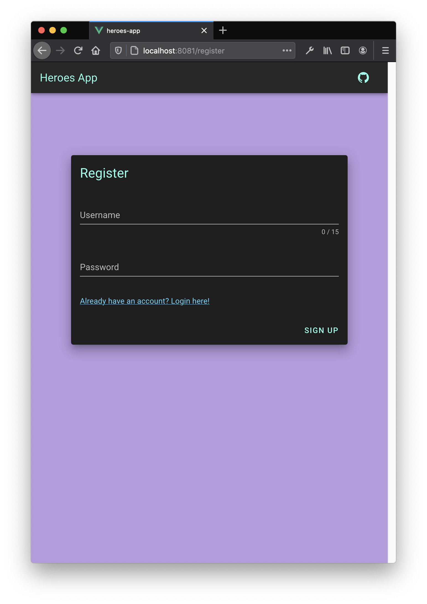

# myHeroesMicroservice

My first microservice. Built with Vue Js (version 2) and Node Js (with Express). The functionality of this app (and more screenshots) can be found in the <strong>heroes-app</strong> repository. Basically it performs CRUD operations on some data. I decided to use heroes. Each hero has a name, info and you can optionally add ayear. I have no idea what I meant by a hero's year, I just wanted an optional parameter :joy:. In the future I hope to:

- [ ] Decouple the view from the logic (ie. separate api calls from view)
- [ ] Make the JWT authentication better (by utilizing refresh tokens and blacklisting with a redis cache)
- [ ] Add statistics to the heroes (like an RPG team builder) and do fun things with that data (maybe using python).
- [ ] Expand and add more functionality, maybe add a dashboard, social media features, a chat client etc.

Because I'm using a microservice architecture I can see myself updating this project and adding new features as I get more ideas (and more free time).

Screencaps:

<p align="middle">



</p>

## Project setup

```
npm install
```

### Compiles and hot-reloads for development

#### Runs entire microservice

```
npm run start
```
